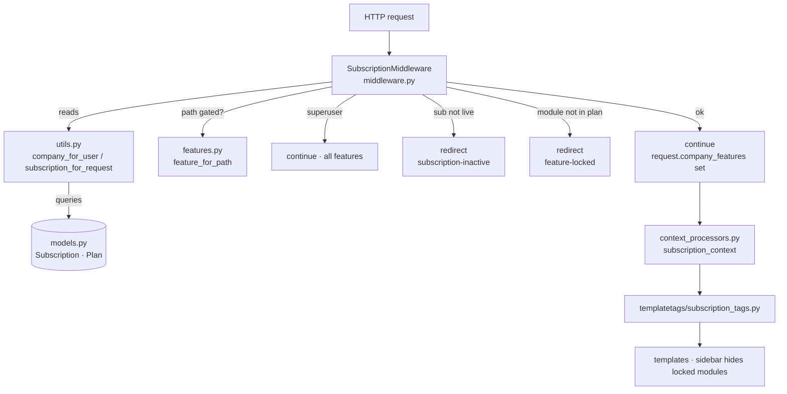

# Subscriptions — SaaS Multi-Tenant Layer

Complete map of the `subscriptions` app: every file, what it does, and how each
piece links to the others. Nothing in the feature is omitted from this document.

Tenant = **Company** (`base.Company`). Each company has exactly **one
Subscription** → one **Plan**. The Plan carries the unlocked modules + seat cap;
the Subscription carries status + dates. Middleware enforces it on every request.
This replaces the old per-deployment `licensing` app.

---

## 1. Complete file tree

```
subscriptions/
├── __init__.py                         # app package marker
├── apps.py                             # AppConfig (name="subscriptions")
├── features.py                         # PAID_FEATURES map: key -> {label, url prefixes, sidebar app}
├── models.py                           # Plan, Subscription (the data)
├── utils.py                            # company_for_user, subscription_for_request, can_add_employee
├── middleware.py                       # SubscriptionMiddleware (enforcement)
├── context_processors.py              # subscription_context -> templates
├── admin.py                            # Django admin for Plan + Subscription
├── views.py                            # console, onboard, subscription_update, impersonate, blocked pages
├── urls.py                             # /manage/...  (owner console, superuser only)
├── client_urls.py                      # /subscription/...  (client blocked pages, exempt)
├── templatetags/
│   ├── __init__.py
│   └── subscription_tags.py            # {{ "pms"|feature_enabled:request }}, {{ request|app_enabled:"x" }}
├── management/
│   ├── __init__.py
│   └── commands/
│       ├── __init__.py
│       └── seed_subscriptions.py       # default plans + active sub for every company
├── migrations/
│   ├── __init__.py
│   └── 0001_initial.py                 # Plan + Subscription tables
└── templates/
    └── subscriptions/
        ├── console.html                # owner dashboard (clients list + actions)
        ├── onboard.html                # create company + admin + subscription
        ├── inactive.html               # shown when a sub is suspended/expired
        └── locked.html                 # shown when a module isn't in the plan
```

### Integration touchpoints (files OUTSIDE the app that were changed)

```
skylinx/settings/base.py                # INSTALLED_APPS += "subscriptions"
                                        # MIDDLEWARE: licensing -> SubscriptionMiddleware
                                        # TEMPLATES context_processors += subscription_context
skylinx/urls.py                         # path("manage/", subscriptions.urls)
                                        # path("subscription/", subscriptions.client_urls)
skylinx_theme/templates/skylinx_theme/components/header.html
                                        # company switcher gated to superuser only
                                        # impersonation "support mode" banner
```

---

## 2. How the files link (request → enforcement)



**Rule:** superuser (platform owner) bypasses everything. Every other user is
resolved to their own Company → its Subscription → enforced.

---

## 3. URL map (every route, verified to reverse)

| URL | url name | view (views.py) | template | access |
|---|---|---|---|---|
| `/manage/` | `subscriptions-console` | `console` | console.html | superuser |
| `/manage/onboard/` | `subscriptions-onboard` | `onboard` | onboard.html | superuser |
| `/manage/company/<id>/update/` | `subscriptions-update` | `subscription_update` | — (redirect) | superuser |
| `/manage/impersonate/<user_id>/` | `subscriptions-impersonate` | `impersonate` | — (redirect) | superuser |
| `/manage/stop-impersonate/` | `subscriptions-stop-impersonate` | `stop_impersonate` | — (redirect) | logged-in |
| `/subscription/inactive/` | `subscription-inactive` | `subscription_inactive` | inactive.html | logged-in |
| `/subscription/locked/` | `feature-locked` | `feature_locked` | locked.html | logged-in |
| `/subscription/stop-impersonate/` | `subscription-stop-impersonate` | `stop_impersonate` | — (redirect) | logged-in |

Routing chain: `skylinx/urls.py` → `subscriptions/urls.py` (`/manage/`) and
`subscriptions/client_urls.py` (`/subscription/`).

---

## 4. Data model

```mermaid
erDiagram
    Company ||--o| Subscription : "has one"
    Plan ||--o{ Subscription : "tier"
    Company ||--o{ Employee : "seats (active)"

    Plan {
        string name
        decimal price
        string billing_cycle
        int seat_limit "null = unlimited"
        json features "list of feature keys"
        bool is_active
    }
    Subscription {
        FK company "OneToOne"
        FK plan
        string status "trial|active|past_due|suspended|cancelled"
        date trial_ends_on
        date expires_on
    }
```

- `Subscription.is_live` = status in {trial, active} AND not expired → grants access.
- `Subscription.feature_keys()` = the Plan's `features` list → what's unlocked.
- `Subscription.seats_used()` = active Employees in that company; `seats_available()` vs `seat_limit`.

**Feature keys** (features.py → also the gated URL prefixes / sidebar apps):
`pms` (/pms/), `recruitment` (/recruitment/, /onboarding/), `payroll` (/payroll/),
`project` (/project/), `asset` (/asset/), `helpdesk` (/helpdesk/),
`biometric` (/biometric/). Core modules (employee, attendance, leave, dashboard,
settings) are never gated.

---

## 5. Console actions (owner workflow)

```mermaid
flowchart LR
    C[/manage/ console] --> O[Onboard: company + admin + trial sub]
    C --> P[Set plan]
    C --> S[Set status: suspend / activate]
    C --> E[Extend +N days]
    C --> I[Log in as client] --> BAN[amber 'support mode' banner] --> X[Exit support mode]
```

---

## 6. Default plans (seed_subscriptions)

| Plan | Price | Seats | Features |
|---|---|---|---|
| Free | 0 | 5 | — |
| Starter | 999 | 25 | payroll, recruitment |
| Pro | 2999 | 100 | payroll, recruitment, pms, asset, helpdesk |
| Enterprise | 7999 | ∞ | all |

Existing companies are auto-assigned **Enterprise / active** so nothing locks out.

---

## 7. Verification (run against the live server)

- ✅ All 8 url names reverse correctly.
- ✅ All 11 modules import without error.
- ✅ `feature_for_path` maps /pms/, /recruitment/, /payroll/, /biometric/ correctly; /employee/ → None (not gated).
- ✅ All 4 templates load.
- ✅ Owner: `/manage/`, `/manage/onboard/` → 200; superuser bypasses gating.
- ✅ Client on **Free** plan hitting `/pms/` → 302 → `/subscription/locked/?f=pms`.
- ✅ Client with **suspended** sub → 302 → `/subscription/inactive/`.
- ✅ Client restored to active → 200.

---

## 8. Known follow-ups (intentionally deferred)

- **Seat enforcement**: `utils.can_add_employee()` exists but isn't yet called in the employee-create view.
- **Sidebar link hiding**: `app_enabled` tag exists; not yet applied in `sidebar.html` (locked links still show but are blocked on click).
- **Company field in forms**: data is scoped + switcher hidden; per-form company dropdowns not yet swept.
- **Billing**: manual; no payment gateway yet.
